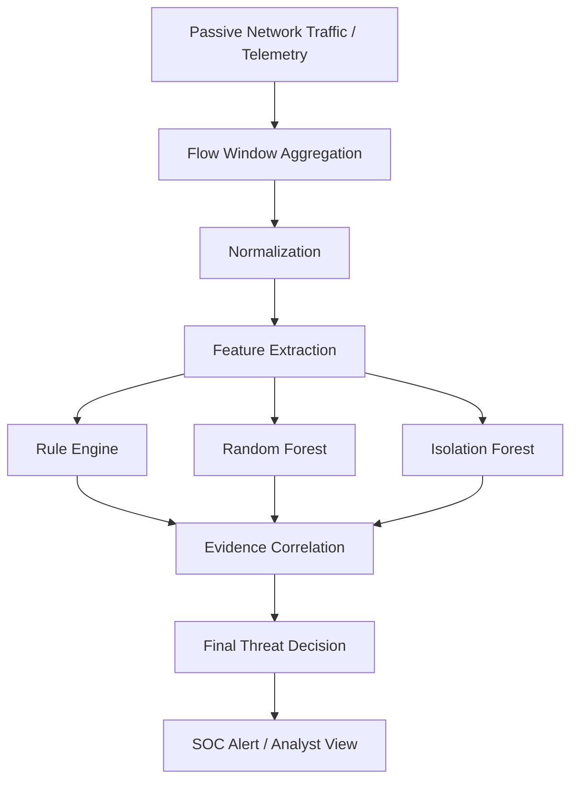

# ORION-Z

### AI-Based Detection of Cyber Threats in Unidirectional IP Traffic

<p align="center">
  <strong>SIH26145 · NTRO · Cyber Security · Software</strong>
</p>

<p align="center">
  Passive network threat detection combining deterministic rules, machine-learning enrichment, behavioral anomaly detection, and explainable security evidence.
</p>

<p align="center">
  <a href="https://github.com/HAFEEZ-SHAIK-POLICHARLA/ORION-Z">
    
  </a>
  
  
  
  
  
</p>

---

## Overview

**ORION-Z** is a security monitoring and threat-detection platform designed for the problem statement:

> **AI-Based Detection of Cyber Threats in Unidirectional IP Traffic**

The system is designed around passive observation of network traffic and behavioral telemetry rather than active probing.

ORION-Z combines:

- deterministic rule-based detection,
- Random Forest machine-learning enrichment,
- Isolation Forest-based behavioral anomaly detection,
- flow and protocol feature extraction,
- evidence correlation,
- explainable threat decisions,
- controlled attack simulation,
- real-time operational monitoring,
- and a SOC-oriented investigation interface.

The goal is to transform low-level network behavior into security information that an analyst can understand and act upon.

---

## Why ORION-Z?

Traditional inspection approaches may rely heavily on packet signatures, known indicators, or active interaction with a network.

ORION-Z takes a different approach:

```text
PASSIVE OBSERVATION
        ↓
FLOW / TELEMETRY
        ↓
FEATURE EXTRACTION
        ↓
DETERMINISTIC DETECTION
        +
ML ENRICHMENT
        +
BEHAVIORAL ANOMALY ANALYSIS
        ↓
EVIDENCE CORRELATION
        ↓
THREAT DECISION
        ↓
SOC ALERT
```

The system is designed to make detection more understandable by associating a decision with the underlying behavioral evidence.

---

# Core Capabilities

## Hybrid Threat Detection

ORION-Z uses multiple complementary detection mechanisms.

### Rule Engine

Deterministic rules evaluate measurable behavioral signals such as:

- packet rates,
- SYN ratios,
- incomplete connections,
- destination-port diversity,
- fan-out behavior,
- DNS characteristics,
- byte/flow asymmetry,
- amplification patterns,
- connection duration,
- protocol and timing characteristics.

Rules provide transparent, deterministic evidence for known behavioral patterns.

### Random Forest

A Random Forest classifier is used as a machine-learning enrichment layer.

It provides additional behavioral classification using extracted network-flow features.

The machine-learning layer complements the deterministic detector rather than replacing it.

### Isolation Forest

Isolation Forest is used for behavioral anomaly detection.

The anomaly layer compares observed feature behavior against a learned baseline and highlights previously unclassified behavioral deviations.

ORION-Z does **not** claim universal zero-day detection.

---

# Supported Threat Scenarios

The current ORION-Z detection and simulation system covers nine major threat scenarios:

| # | Threat Scenario | Detection Focus |
|---|---|---|
| 1 | SYN Flood | Excessive SYN activity and incomplete connections |
| 2 | Port Scanning | Destination-port diversity and scanning behavior |
| 3 | DNS Tunnelling | DNS entropy, query characteristics, and unusual patterns |
| 4 | DGA | Suspicious domain lexical characteristics and entropy |
| 5 | Beaconing | Periodic communication and inter-arrival behavior |
| 6 | Encrypted Session | TLS/QUIC metadata and timing characteristics |
| 7 | Data Exfiltration | Outbound asymmetry and suspicious transfer behavior |
| 8 | UDP Amplification | Reflection/amplification characteristics |
| 9 | Slowloris | Long-lived partial connections |

The exact evidence used for a decision depends on the detector and available telemetry.

---

# Detection Architecture



The architecture intentionally separates:

1. observation,
2. feature extraction,
3. deterministic evaluation,
4. ML enrichment,
5. anomaly analysis,
6. evidence correlation,
7. final decision.

---

# ORION-Z Product Flow

```text
Observe
   ↓
Detect
   ↓
Explain
   ↓
Investigate
   ↓
Respond
```

### Observe

Passively collect or receive network-flow telemetry.

### Detect

Evaluate behavior using deterministic rules and machine-learning components.

### Explain

Associate alerts with measurable evidence and detector reasoning.

### Investigate

Present threat details through the SOC-oriented application interface.

### Respond

Provide analyst-ready security context for further action.

---

# Application Workspaces

The ORION-Z application is organized into distinct workspaces.

## Threat Lab

A controlled environment for replaying known threat scenarios and demonstrating detector behavior.

Threat Lab is intended for:

- demonstrations,
- controlled testing,
- detector validation,
- scenario visualization,
- judge-facing exploration.

Simulation data is explicitly separated from live operational data.

---

## Lab Results

A simulation-focused results workspace.

It presents:

- simulated alerts,
- threat distributions,
- flow/detection results,
- scenario results,
- simulation-derived analytics.

Simulation results do not represent live network activity.

---

## Threat Intelligence

A reference and knowledge workspace covering the supported ORION-Z threat scenarios.

Each threat is presented using:

- plain-language explanation,
- technical explanation,
- example behavior,
- detector-relevant concepts,
- visual technical context.

---

## Dashboard

The operational dashboard represents live application state.

Simulation data is deliberately separated from live operational state.

When a live sensor is not connected, the dashboard does not incorrectly present the environment as safe.

---

## Real-Time Detection

The Real-Time Detection workspace is intended for continuous passive traffic monitoring.

The conceptual pipeline is:

```text
Live Traffic / Flow Telemetry
        ↓
Aggregation / Normalization
        ↓
Feature Extraction
        ↓
Rules + Random Forest + Isolation Forest
        ↓
Evidence Correlation
        ↓
Decision
        ↓
Real-Time Alert
```

Possible system states include:

- `SAFE`
- `UNSAFE`
- sensor unavailable / not connected

Actual live packet capture requires a host-level sensor environment.

---

## System Health

System Health provides visibility into important application components, including:

- frontend/application status,
- FastAPI backend,
- real-time detection engine,
- rule engine,
- ML/anomaly engine,
- WebSocket/live telemetry path,
- storage/database state,
- overall system status.

---

# Controlled Simulation vs Live Detection

ORION-Z explicitly separates controlled simulation from live operational monitoring.

```text
                 ORION-Z
                    │
         ┌──────────┴──────────┐
         │                     │
         ▼                     ▼
   CONTROLLED LAB          LIVE OPERATIONS
         │                     │
         ▼                     ▼
     Threat Lab          Real-Time Detection
         │                     │
         ▼                     ▼
 Simulation data         Live sensor state
```

The Threat Lab does not represent live packet capture.

The landing page and demonstration visuals are presentation-only and do not initiate the live detection engine.

---

# Explainability

An important ORION-Z design principle is that an alert should be associated with understandable evidence.

A detection may incorporate signals such as:

```text
THREAT DETECTED

Observed Evidence
├── Packet-rate behavior
├── SYN ratio
├── Connection completion behavior
├── Port distribution
├── DNS characteristics
├── Timing / periodicity
├── Byte asymmetry
└── Behavioral anomaly score

        ↓

Detector Evaluation

        ↓

Evidence Correlation

        ↓

Final Decision
```

The exact evidence depends on the detected scenario.

ORION-Z does not rely on unexplained black-box labels as the sole basis for a security decision.

---

# Technology Stack

## Frontend

- React
- TypeScript
- Vite
- React Router
- CSS-based visual system and animations
- Reusable SVG/network visualizations

## Backend

- Python
- FastAPI
- WebSocket-based application communication
- Replay/simulation management
- Detection pipeline

## Machine Learning

- Scikit-learn
- Random Forest
- Isolation Forest
- Feature-based behavioral analysis

## Network / Sensor Layer

For host-level live packet capture on Windows:

- Npcap
- passive packet/flow acquisition
- network-interface telemetry

## Storage

The project includes application storage/vector infrastructure required by the current implementation.

---

# Project Structure

```text
ORION-Z/
│
├── backend/
│   └── src/
│       └── sih_detector/
│           ├── api.py
│           ├── detectors.py
│           ├── live.py
│           ├── model.py
│           ├── replay.py
│           ├── schemas.py
│           └── ...
│
├── frontend/
│   ├── public/
│   ├── src/
│   │   ├── components/
│   │   │   ├── attack-graphics/
│   │   │   ├── landing/
│   │   │   ├── AttackExplainer.tsx
│   │   │   ├── DashboardView.tsx
│   │   │   ├── Header.tsx
│   │   │   ├── LabResultsView.tsx
│   │   │   ├── LandingView.tsx
│   │   │   ├── RealTimeView.tsx
│   │   │   ├── Sidebar.tsx
│   │   │   ├── ThreatLabView.tsx
│   │   │   └── ...
│   │   ├── App.tsx
│   │   ├── api.ts
│   │   ├── main.tsx
│   │   ├── styles.css
│   │   ├── types.ts
│   │   └── ...
│   ├── package.json
│   └── ...
│
├── data/
│   └── fixtures/
│
├── models/
│
├── .agents/
│
├── skills-lock.json
│
└── README.md
```

---

# Getting Started

## Prerequisites

Recommended development environment:

- Windows 10/11 for live packet-capture development
- Node.js
- npm
- Python 3.x
- Git

For live Windows packet capture, Npcap must be installed and configured on the sensor host.

---

## Clone the Repository

```bash
git clone https://github.com/HAFEEZ-SHAIK-POLICHARLA/ORION-Z.git
cd ORION-Z
```

---

# Frontend Development

```bash
cd frontend
npm install
npm run dev
```

The Vite development server will expose the ORION-Z frontend locally.

---

# Backend Development

The backend is implemented using FastAPI.

The primary backend application is located at:

```text
backend/src/sih_detector/api.py
```

Start the backend using the project's configured FastAPI application entrypoint and Python environment.

The backend provides the application API, simulation/replay functionality, detection processing, and live operational interfaces used by the frontend.

---

# Threat Lab

The Threat Lab is designed for controlled demonstration and validation.

Supported scenarios:

```text
SYN Flood
Port Scanning
DNS Tunnelling
DGA
Beaconing
Encrypted Session
Data Exfiltration
UDP Amplification
Slowloris
```

The simulation lifecycle follows:

```text
ATTACK
  ↓
OBSERVE
  ↓
EXTRACT
  ↓
EVALUATE
  ↓
ENRICH
  ↓
DECISION
```

Simulation completion is tied to backend replay state and visual completion state rather than an arbitrary fixed timer.

---

# Live Sensor Architecture

A deployed browser application cannot directly access raw Ethernet traffic from the end user's computer.

For actual passive capture, ORION-Z uses a host-level sensor architecture.

```text
            CLOUD / DEPLOYED APPLICATION
                     │
                HTTPS / WSS
                     │
                     ▼
             ORION-Z Backend
                     │
                     │
              Outbound connection
                     │
                     ▼
          ┌────────────────────────┐
          │ Windows Sensor Host    │
          │                        │
          │ Npcap                  │
          │ Network Interface      │
          │ Passive Capture        │
          └────────────────────────┘
```

This allows the web application and detection platform to remain remotely accessible while packet capture remains on the machine that actually has access to the monitored interface.

For a short live demonstration, the sensor host should be prepared in advance rather than requiring the audience to install packet-capture software during the presentation.

---

# Sensor Availability

If the host-level sensor is not available, ORION-Z should communicate that state explicitly.

It should not silently replace unavailable live packet capture with fabricated live telemetry.

A typical diagnostic state is:

```text
LIVE SENSOR SETUP REQUIRED
```

or:

```text
SENSOR NOT READY
```

The application can then expose setup diagnostics and sensor requirements.

---

# Development Workflow

A recommended workflow is:

```text
1. Run backend
2. Run frontend
3. Open ORION-Z
4. Validate Threat Lab
5. Validate Lab Results
6. Validate live/sensor state
7. Run automated tests
8. Build production frontend
```

---

# Testing

Frontend TypeScript validation:

```bash
npx tsc --noEmit
```

Frontend production build:

```bash
npm run build
```

Backend test suite:

```bash
pytest
```

The current development snapshot has been verified with:

- successful frontend production build,
- successful backend test suite,
- verified simulation alert propagation,
- verified source-mode separation,
- verified scenario lifecycle behavior.

---

# Design Principles

ORION-Z follows several product principles.

### Passive First

Observe network behavior without requiring active probing.

### Hybrid Detection

Combine deterministic rules, classification, and behavioral anomaly analysis.

### Evidence Over Labels

A security alert should be accompanied by meaningful supporting evidence.

### Simulation ≠ Live

Controlled demonstrations must remain separate from actual operational state.

### No Silent Failure

Unavailable live sensors should be represented explicitly rather than disguised as safe or normal operation.

### Analyst-Oriented UX

The system should help an analyst move from traffic to evidence to a meaningful security decision.

---

# Security and Accuracy Considerations

ORION-Z is a detection prototype and research-oriented security platform.

Its current implementation should not be interpreted as a guarantee of complete network security or universal attack detection.

In particular:

- ML scores depend on trained models and available features.
- Rule thresholds are scenario-dependent.
- Anomaly detection identifies behavioral deviations from a learned baseline.
- Detection quality depends on telemetry quality and feature availability.
- Live capture requires appropriate host permissions and packet-capture infrastructure.
- Controlled simulation results should not be interpreted as production-network measurements.

The project does not claim universal zero-day detection.

---

# Project Status

Current ORION-Z capabilities include:

- [x] V2 application shell
- [x] Reference-driven landing page
- [x] Threat Lab
- [x] Lab Results
- [x] Threat Intelligence
- [x] Operational Dashboard
- [x] Real-Time Detection interface
- [x] System Health
- [x] Nine threat scenarios
- [x] Hybrid rule + ML architecture
- [x] Random Forest enrichment
- [x] Isolation Forest anomaly detection
- [x] Evidence-oriented alerting
- [x] Simulation/live source separation
- [x] WebSocket application communication
- [x] Windows passive-capture architecture
- [x] Controlled replay lifecycle
- [x] Production frontend build verification

---

# Roadmap

Potential future work includes:

- broader live sensor deployment support,
- expanded telemetry sources,
- additional behavioral detectors,
- more extensive datasets,
- model retraining and evaluation pipelines,
- analyst feedback loops,
- richer incident-response workflows,
- production-scale sensor management,
- broader protocol coverage.

---

# References

The project draws on established cybersecurity and machine-learning concepts and references including:

### MITRE ATT&CK — Network Sniffing / T1040

https://attack.mitre.org/techniques/T1040/

### CIC-IDS2017

https://www.unb.ca/cic/datasets/ids-2017.html

### CICFlowMeter

https://github.com/ahlashkari/CICFlowMeter

### Scikit-learn Random Forest

https://scikit-learn.org/1.7/modules/generated/sklearn.ensemble.RandomForestClassifier.html

### Scikit-learn Isolation Forest

https://scikit-learn.org/1.5/modules/generated/sklearn.ensemble.IsolationForest.html

### Npcap

https://npcap.com/

---

# Repository

GitHub:

https://github.com/HAFEEZ-SHAIK-POLICHARLA/ORION-Z

---

# License

ORION-Z is released under the MIT License.

See [`LICENSE`](LICENSE) for the complete license text.

---

# Acknowledgements

ORION-Z was developed as a solution to:

**SIH26145 — AI-Based Detection of Cyber Threats in Unidirectional IP Traffic**

under the **Cyber Security** theme.

The project combines network-security engineering, machine learning, passive telemetry analysis, and SOC-oriented product design into a unified prototype.

---

<p align="center">
  <strong>ORION-Z</strong><br>
  Passive intelligence for network threat detection.
</p>
